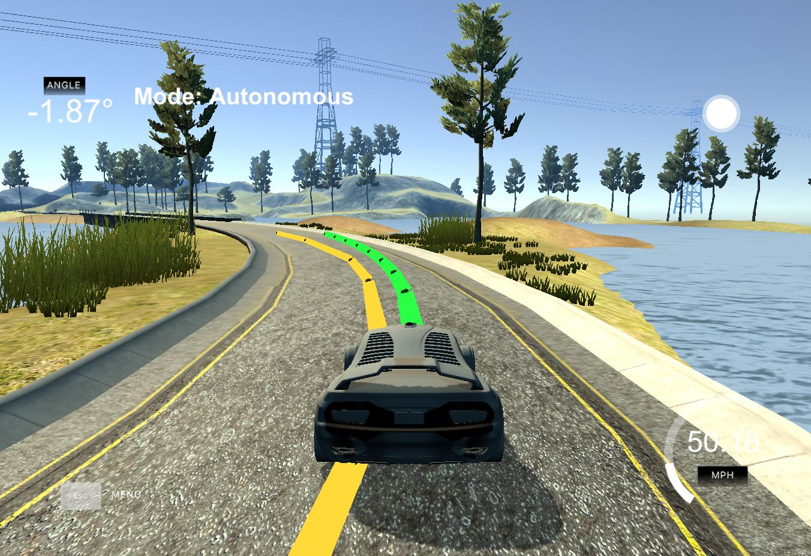
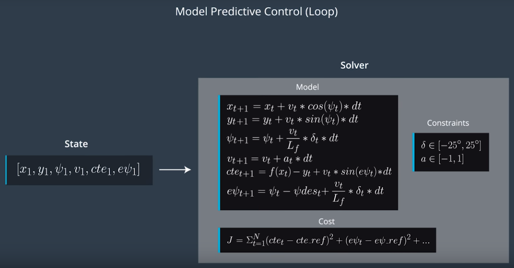

# Model Predictive Control
Programming Udacity's car simulator to follow a given trajectory

---

## Overview
The objective of this project is to code the MPC (model predictive controller), to control a simulated car along a simulated trajectory as close as possible.

As the name implies, given some actuation or **control** (steering and acceleration in this project) the MPC **predicts** the movement of the car based on a **model** (we use the bicycle model here), followed by calculation of the new errors based on deviation from the reference trajectory. A set of actuations is calculated that minimizes the error metric, for the course of the predictions. Once we have the best actuations constrained by certain conditions (speed, steering range and rate, etc.), we send the first set of actuations to the car and repeat the process again.

## The Model
As mentioned above, we use the bicycle model to predict the motion of our Car. These can be best summarized by the graphic from Udacity's SDC course below:

Here, cte and epsi are the cross-track and heading errors respectively.

## Prediction duration and Latency correction
In order to implement MPC, we need to select the number of steps we predict the car's state into the future for and the duration in between them.
There is a tradeoff to consider here: As the number of steps increases, we can assess and provide better initial actuations that will keep the car in control however, this increases computation cost and potentially computation time. This can lead to a lot of wasted power since we only keep and use the first actuations, discarding the rest. Furthermore, longer computation times mean the system won't be performing real-time, which is not desirable for a self-driving car.
On the other hand, we risk poor duration accuracy if we use low number of steps.
Experimenting with high values (N=50 and dt=0.05) it can be seen that the car tends to waver and eventually go off track. This seems to happen since the long duration fit creates actuations that are sensitive. Lower values (N=20 w/ dt=0.05) seemed to work much better.
In order to correct for latency, I've set the dt parameter to 0.1 (equal to the latency itself) with N=10.

## Trajectory considerations
The simulator provides the model with waypoints - this is through where we ideally want our car to pass through, essentially defining our trajectory.
In order to be able to predict where our car should be on the trajectory given the future coordinates of our car, we need an equation that calculates the same. For this purpose, we regress a 3rd order polynomial to our waypoints.

Another point to consider is that our CTE calculations become simpler if we convert the given waypoints from the map to vehicle coordinate system. This is also how we plot out the reference and actual trajectory on the map.
